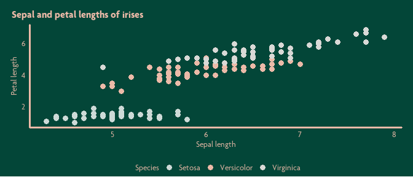
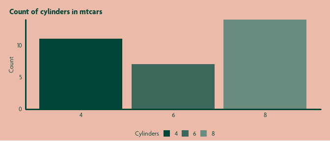
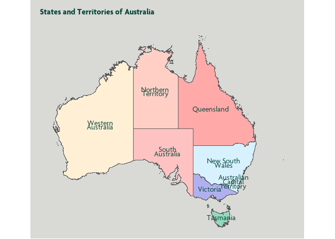
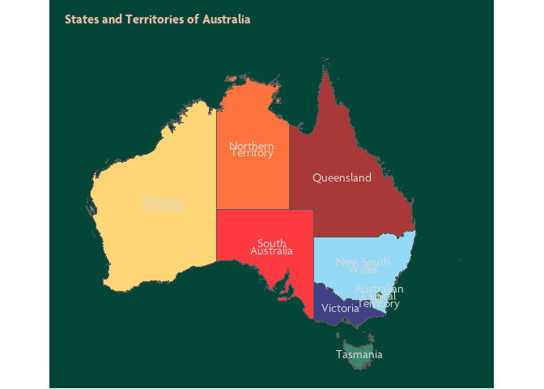

<!-- README.md is generated from README.Rmd. Please edit that file -->

# cubieR

<!-- badges: start -->
<!-- badges: end -->

cubieR is a package containing tools to be used by staff at Cube Group.

These tools are principally geoms, palettes and themes used to ensure
data visualisations are produced in accordance with the Cube Group
branding guidelines.

## Installation

You can install the development version of cubieR like so:

``` r
# install.packages("devtools")
devtools::install_github("zerogetsamgow/cubieR")
```

## Welcome to the cubieverse

The primary focus of {cubieR} and the associated {cubepalette} is to
help Cubies create great data visualisations simply in ggplot2.

{cubieR} provides themes in three principal colours {cube.green},
{cube.lightorange} and {cube.white} provides wrapper functions to
utilise existing {ggplot2} and {ggrounded} geoms in the Cube Group
style.

{cubepalette} provides colours and palettes.

These can be used with {ggplot2} as shown below

``` r
library(cubieR)

ggplot(
  data=ggplot2::mpg |>  
    mutate(trans = str_remove(trans,"\\(.*\\)")) |> 
    group_by(cyl, trans) |> 
    summarise(count = n()),
  aes(x = cyl,y = count, colour = trans, fill = trans))+
  geom_col_cube() +
  scale_color_manual(guide = "none", values = cube_palettes_discrete$light) +
  scale_fill_manual(name = "Transmission", values = cube_palettes_discrete$light, labels = str_to_title) +
  scale_x_continuous(name = "Number of cyclinders") +
  scale_y_continuous(name = "Count",expand=c(0,0)) +
  theme_cube_green()
```


## Three themes to cubify them all

{cubieR} exports three themes - `theme_cube_white()`(seen above),
`theme_cube_green()` and `theme_cube_orange` to enable plots to be
produced for any Cube publication.

Each of these themes is designed to work with different discrete
palettes from {cubepalette}:

- `theme_cube_white()` with `cube_palette_discrete$dark`

- `theme_cube_green()` with `cube_palette_discrete$light`

``` r
## basic example of a green plot
ggplot(data=iris,aes(x=Sepal.Length, y = Petal.Length,colour=Species)) +
  geom_point(size=3) +
  scale_colour_manual(values=cube_palettes_discrete$light,labels=stringr::str_to_title) +
  scale_x_continuous(name="Sepal length")+
  scale_y_continuous(name="Petal length")+
  labs(title="Sepal and petal lengths of irises")+
  theme_cube_green()
```



- `theme_cube_orange()` with `cube_palette_discrete$other`

These themes can also work with the `cube_palette_tints` palettes
`greys`,`greens` and `oranges`.

``` r
## basic example of a green plot
ggplot(data=mtcars,aes(x = as.factor(cyl), colour=NULL, fill=as.factor(cyl), group=cyl)) +
  geom_histogram(stat="count")+
  scale_fill_manual(
    name="Cylinders", 
    values=cube_palettes_tints$greens,labels=stringr::str_to_title) +
  scale_y_continuous(name="Count", expand=c(0,0.04))+
  scale_x_discrete(name=NULL)+
  labs(title="Count of cylinders in mtcars")+
  theme_cube_orange()
#> Warning in geom_histogram(stat = "count"): Ignoring unknown
#> parameters: `binwidth`, `bins`, and `pad`
```



As well as utilising the {cubepalette} these themes are rendered using
{showtext} to allow the use of `Open Sans` font.

## Maps for any background

{cubieR} exports a theme - `theme_cube_map()` to be used when plotting
maps. This theme can be produced with white, green, orange or grey
backgrounds. White is the default. Green and grey work with the default
background colours in Cube’s PowerPoint template.

    #> Linking to GEOS 3.11.2, GDAL 3.7.2, PROJ 9.3.0; sf_use_s2() is
    #> TRUE

``` r

## basic example of a map with grey background
ggplot(
  data = 
    strayr::read_absmap(
      name="state2021",
      remove_year_suffix = TRUE
      ) |> 
    filter(state_name %in% strayr::state_name_au) |> 
    mutate(state_name = 
             factor(
               state_name, 
               levels=strayr::state_name_au)
           ),
  aes(fill=state_name, x=cent_long, y =cent_lat, label = str_wrap(state_name,10))) +
  geom_sf() +
  geom_text(family="Agenda",colour = cubepalette::cube.darkgreen, lineheight=.5)+
  scale_fill_manual(guide='none',values=colorspace::lighten(strayr::palette_state_name_2016,.7)) +
  labs(title="States and Territories of Australia")+
  theme_cube_map(base_colour = "grey", base_size = 10)
```



``` r

## basic example of a map with grey background
ggplot(
  data = 
    strayr::read_absmap(
      name="state2021",
      remove_year_suffix = TRUE
      ) |> 
    filter(state_name %in% strayr::state_name_au) |> 
    mutate(state_name = 
             factor(
               state_name, 
               levels=strayr::state_name_au)
           ),
  aes(fill=state_name, x=cent_long, y =cent_lat, label = str_wrap(state_name,10))) +
  geom_sf() +
  geom_text(family="Agenda",colour = cubepalette::cube.grey, lineheight=.5)+
  scale_fill_manual(guide='none',values=colorspace::lighten(strayr::palette_state_name_2016,.2)) +
  labs(title="States and Territories of Australia")+
  theme_cube_map(base_colour = "green", base_size = 10)
#> Reading state2021 file found in C:\Users\SAMUEL~1\AppData\Local\Temp\RtmpWOlYCt
```


