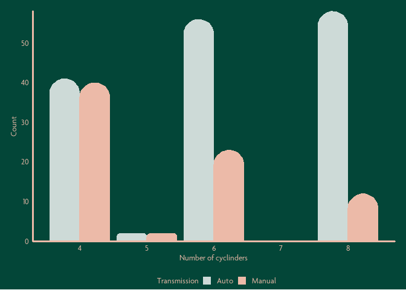

<!-- README.md is generated from README.Rmd. Please edit that file -->

# cubieR

<!-- badges: start -->
<!-- badges: end -->

cubieR is a package containing tools to be used by staff at Cube Group.

These tools are principally geoms, palettes and themes used to ensure
data visualisations are produced in accordance with the Cube Group
branding guidelines.

## Installation

You can install the development version of cubieR like so:

``` r
# install.packages("devtools")
devtools::install_github("zerogetsamgow/cubepalette")
```

## Welcome to the cubieverse

The primary focus of {cubieR} and the associated {cubethemes} and
{cubepalette} is to help Cubies create great data visualisations simply
in ggplot2.

{cubepalette} provides colours and palettes. {cubethemes} provides
palettes in three principal colours {cube.green}, {cube.pink} and
{cube.white} {cubieR} provides wrapper functions to utilising existing
{ggplot2} and {ggrounded} geoms in the Cube Group style.

These can be used with {ggplot2} as shown below

``` r
library(cubieR)
library(cubepalette)
library(cubethemes)

ggplot(
  data=ggplot2::mpg %>% 
    mutate(trans=str_remove(trans,"\\(.*\\)")) %>%
    group_by(cyl, trans) %>% summarise(count=n()),
  aes(x=cyl,y=count,colour=trans, fill=trans))+
  geom_col_cube() +
  scale_color_manual(guide=FALSE,values=cube_palettes_discrete$light) +
  scale_fill_manual(name="Transmission",values=cube_palettes_discrete$light, labels=stringr::str_to_title)+
  scale_x_continuous(name="Number of cyclinders")+
  scale_y_continuous(name="Count", 
                     expand=c(0,0)
                     )+
  theme_cube_green()
```


